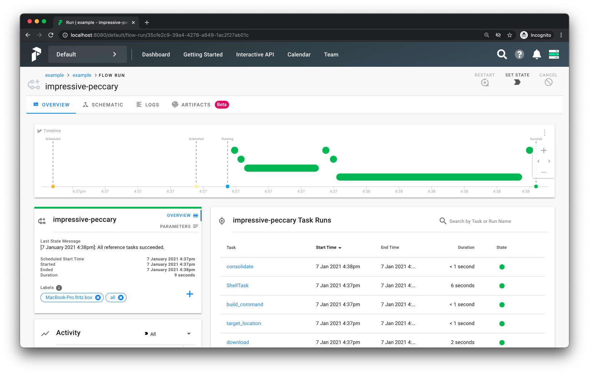

Simple Prefect example
======================

This repository lays out the basic steps for running a prefect workflow
which converts an image into OME-Zarr with bioformats2raw.

1. Create & activate a conda environment

```
conda env create -n ex -f environment.yml
conda activate ex
```

2. Start the server (Terminal 1)

```
prefect backend server
prefect server start
```

3. Start a local agent (Terminal 2)

```
prefect agent start local -l all
```

Note: `all` here is a label for matching agents to flows.

4. Define and register your flow (Terminal 3)

```
./pipeline.py
(tmp) /tmp/prefect-example $./pipeline.py
Result check: OK
Flow: http://localhost:8080/flow/13ca6a60-e633-491d-a102-eaa5ab162a4f
```

5. Follow the URL to launch the pipeline

click "Quick run"


